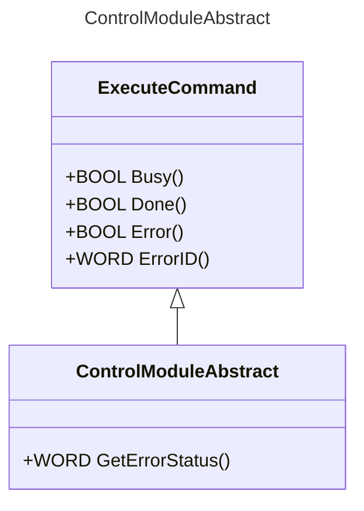
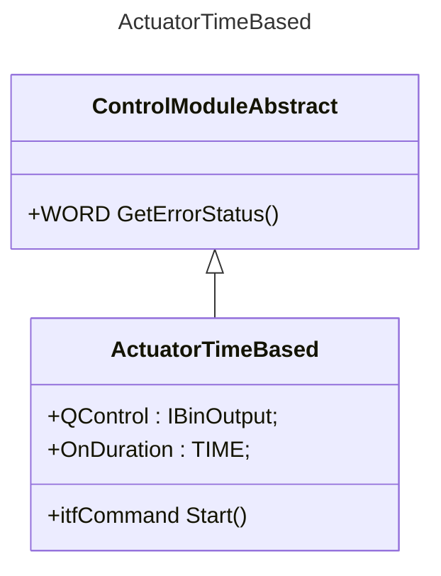
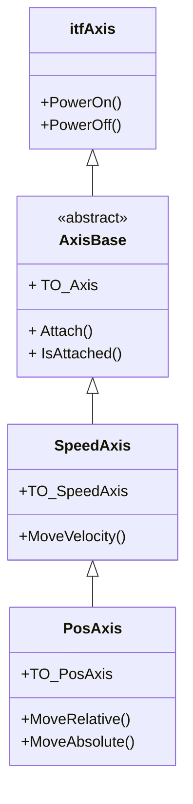
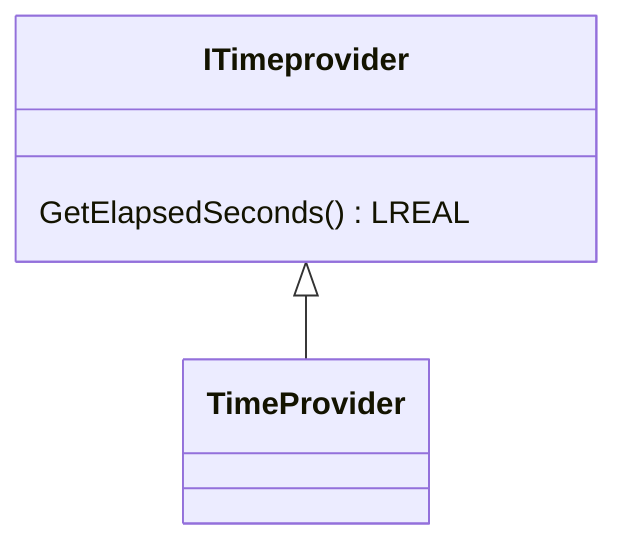

# @simatic-ax.axftcmlib


## Description

This library was created for the `Fischertechnik Factorysimulation 24V`. It contains classes for the basic elements of this Model.
In the current state only the `SortingLine` is finished and can be fully implemented using this library.
This library includes the following classes:

- Actuator
- Compressor
- ColorSensor
- Axis
- TimeBasedEncoder
- Motor

Those classes can be used for the calculation of the position based on the time.

## Install this package

Enter:

```cli
apax add @simatic-ax/axftcmlib
```

## Namespace

```iec-st
Simatic.Ax.axftcmlib
```

## Classes

### ControlModuleAbstract

This is a base class for all control modules



### Class ActuatorTimeBased



| Method  | Description                                          |
|---------|------------------------------------------------------|
| Start() | Actuator will be activated for the time `OnDuration` |

<details><summary>Example for the class Cylinder ... </summary>
  
```iec-st
  VAR_GLOBAL
      Actuator : ActuatorTimeBased := (QControl := Q_Actuator) ;
      Q_Actuator : BinOutput;
      DQ : BOOL;
  END_VAR

  PROGRAM
    cmd := Actuator.Start();
    IF NOT(cmd.Busy()) THEN 
      IF (cmd.Done()) THEN
        ; // your code
      END_IF;
    END_IF;
    DQ := Q_Actuator.Q();  // True if actuator is active
  END_PROGRAM
  
```

</details>

### Class Compressor

| Method    | Description              |
|-----------|--------------------------|
| Enable()  | Turns the compressor on  |
| Disable() | Turns the compressor off |

<details><summary>Example for the class Compressor ... </summary>
  
```iec-st
  VAR_GLOBAL
      Compressor : Compressor := (QControl := Q_Compressor) ;
      Q_Compressor : BinOutput;
      DQ : BOOL;
  END_VAR

  PROGRAM
    cmd := Compressor.Enable();
    IF NOT(cmd.Busy()) THEN 
      IF (cmd.Done()) THEN
        ; // your code
      END_IF;
    END_IF;
    DQ := Q_Compressor.Q();  // True if compressor is active
    cmd := Compressor.Disable();
    DQ := Q_Compressor.Q();  // returns False
  END_PROGRAM
  

</details>

### Class ColorSensor

| Method                                                                      | Description                                                                                                                                                                      |
|-----------------------------------------------------------------------------|----------------------------------------------------------------------------------------------------------------------------------------------------------------------------------|
| DetectColor(DetectedColor : INT, ColorArray : ARRAY[*] OF ColorRange) : INT | Takes INT-value from sensor and compares it to a Array to find the correct color. ColorArray is a Array of ColorRanges which contains the thresholds for the corresponding color |

<details><summary>Example for the class ColorSensor ... </summary>
  
```iec-st
  
  VAR_GLOBAL
    SortingLineColorSensorValue : INT; //Actual Value provided from the sensor
    ColorSensorClassInstance : ColorSensor; //Instance of the class
    ColorValueArray[0..1] OF ColorRange := [(StartValue := 19801, EndValue := 30000, color := Colors#UNKNOWN), (StartValue := 6000, EndValue := 9999, color := Colors#WHITE)];
      //Gives the area in which each color is set
      ResultColor : INT;
  END_VAR

  
  PROGRAM
    ResultColor :=  ColorSensorClassInstance.detectColor(DetectedColor := SortingLineColorSensorValue, ColorArray := ColorValueArray);
    //outputs the detected color as an INT/ TYPE Colors (from Lib)
  END_PROGRAM
```

</details>

<details><summary>Colors and ColorRange ... </summary>

```iec-st

  ///Contains all Colors that the Sensor should know -> Can be expanded
  TYPE
      Colors : INT (UNKNOWN := 10, WHITE := 1, RED := 2,  BLUE := 3); // default value = UNKNOWN
  END_TYPE

  ///Defines the area in which the values equals a certain color
  TYPE
      ColorRange : STRUCT
          StartValue : INT;
          EndValue : INT;
          Color : colors;
      END_STRUCT;
  END_TYPE
```

</details>

## Axis

This Axis concept has the same look and feel like the Motion Control Library in Siamtic AX. It is designed for Fischertechnik Models whre just a simple On/Off-Motor is used.

### Class Diagram



### SpeedAxis

**Methods:**

| Method                                                 | Description                                |
|--------------------------------------------------------|--------------------------------------------|
| PowerOn()                                              | Switch the SpeedAxis on                    |
| PowerOff()                                             | Switch the SpeedAxis off                   |
| Attach(REF_TO TO_Axis)                                 | Attach the TO_Axis to the AxisBase         |
| MoveVelocity (Velocity : LREAL, Direction : Direction) | starts movement depending on the direction |
| Halt()                                                 | Stops any current movement                 |

### PosAxis

| Method                                                                        | Description                                      |
|-------------------------------------------------------------------------------|--------------------------------------------------|
| PowerOn()                                                                     | Switch the SpeedAxis on                          |
| PowerOff()                                                                    | Switch the SpeedAxis off                         |
| Attach(REF_TO TO_Axis)                                                        | Attach the TO_Axis to the AxisBase               |
| MoveVelocity (Velocity : LREAL, Direction : Direction)                        | starts movement depending on the direction       |
| MoveRelative( distance : LREAL, velocity : LREAL)                             | Moves the axis by `distance`                     |
| MoveAbsolute( position : LREAL, velocity : LREAL)                             | Moves the axis to the `position`                 |
| HomeDirect(Position : LREAL)                                                  | Set the actual position to `value`               |
| ActiveHoming(Position : LREAL, Direction : Direction, RefSensor : IBinSignal) | Find the reference sensor and set the `position` |
| Halt()                                                                        | Stops any current movement                       |

### Example

```iec-st
    
VAR_GLOBAL
  TASK Main (PRIORITY := 1);
  PROGRAM P1 WITH Main : MyAxis;
  DQ_MFwd AT %Q0.0 : BOOL;
  DQ_MRvs AT %Q0.1 : BOOL;
  Q_MFwd : BinOutput;
  Q_MRvs : BinOutput;
  Motor : MotorBiDirectional := (QForward := Q_MFwd, QReverse := Q_MRvs);
  To_Axis : TO_PosAxis := (Motor := Motor, Encoder := timeBasedEncoder);
  Axis : PosAxis;
  TimeProvider : TimeProvider;
  TimeBasedEncoder : TimeBasedEncoder := (
    Velocity := 0.065,
    TO_Axis := REF(To_Axis),
    TimeProvider := TimeProvider);
  start : BOOL;
END_VAR

PROGRAM MyAxis 
  VAR_EXTERNAL
    DQ_MFwd : BOOL;
    DQ_MRvs : BOOL;
    Q_MFwd : BinOutput;
    Q_MRvs : BinOutput;
    Axis : PosAxis;
    To_Axis : TO_PosAxis;
    start : BOOL;
  END_VAR
  VAR_TEMP
    cmd : itfCommand;
  END_VAR
  Axis.Attach(axis := REF(To_Axis));
  Axis.PowerOn();
  Axis.HomeDirect(Position := 0.0);
  IF (start) THEN
    cmd := Axis.MoveRelative(Distance := 100.0);
    start := FALSE;
  END_IF;
  IF cmd <> NULL THEN
    IF NOT(cmd.Busy()) THEN
      IF cmd.Done() THEN
        Axis.PowerOff();
        cmd := NULL;
      ELSIF cmd.Error() THEN
        ;
      END_IF;
    END_IF;
  END_IF;
END_PROGRAM

```

## TimebasedEncoder

The time-based encoder can be used when no physical encoder (such as an incremental encoder or TM-Count module) is available. For this purpose, a `TimeProvider` is required. The `TimeProvider` measures the elapsed time between two calls, enabling the calculation of the moved distance based on the given speed and the elapsed time.

If you invoke the encoder in a different task (e.g., a 10ms interrupt), you can implement an alternative `TimeProvider` that consistently returns 10.0 [ms].

**Properties**

| Property     | Description                                                                              |
|--------------|------------------------------------------------------------------------------------------|
| Velocity     | Velocity of the mechanical part                                                          |
| TO_Axis      | A reference to a TO_PosAxis                                                              |
| TimeProvider | An interface that provides time-related functions, to calculate the distance ds = dt * v |

**Methods**

| Method        | Description                                                                                                             |
|---------------|-------------------------------------------------------------------------------------------------------------------------|
| Reset         | Resets the encoder position to 0.0.                                                                                     |
| SetValue      | Sets the encoder to a specific position. Takes `value` as input, which is the position to be set.                       |
| GetValue      | Returns the current encoder position in millimeters.                                                                    |
| Evaluate      | Calculates the change in position based on the elapsed time and velocity. Updates position if the axis is running.      |
| HasMoved      | Method implemented due to the interface. Currently serves no other purpose.                                             |
| RelativeCount | Returns the relative count position in millimeters. Converts the internal relative position from meters to millimeters. |
| ResetRelative | Resets the relative position to 0.0.                                                                                    |
| SetDirection  | Sets the direction mode for counting. Takes `mode` as input, which specifies the count mode.                            |
| GetModulo     | Method implemented due to the interface. Currently serves no other purpose.                                             |

### TimeProvider



| Method                                         | Description                                |
|------------------------------------------------|--------------------------------------------|
| Move(Velocity : LREAL, direction := Direction) | starts movement depending on the direction |
| Halt()                                         | Stops any current movement                 |

### MotorBiDirectional

<details><summary>Motor ... </summary>
  
| Method                                         | Description                                |
|------------------------------------------------|--------------------------------------------|
| Move(Velocity : LREAL, direction := Direction) | starts movement depending on the direction |
| Halt()                                         | Stops any current movement                 |

The motor is usually completely controlled through the Axis but needs to manually write on the output.

```iec-st

  VAR_GLOBAL
    SortingLineMotor : BOOL; //Actual PLC-variable
    MotorOutputWriterForward : BinOutput; //Used to write on the PLC-variable
    MotorOutputWriterReverse : BinOutput; //Used to write on the PLC-variable
    MotorClassInstance : MotorFT := (Forward := MotorOutputWriterForward, Reverse := MotorOutputWriterReverse ); //Class instance initialized with the needed OutputWriter
  END_VAR

  PROGRAM
  //The methods of the motor are all called by the axis but could be added here.
   MotorClassInstance.MoveVelocity(Velocity := 1.0, direction := Direction#Forward);
   MotorOutputWriterForward.WriteCyclic(Q =>SortingLineMotor);//Writing on the Actual PLC-variable ->needs to be called in every cycle
  END_PROGRAM

```

</details>

<details><summary>Encoder + TimeProvider ... </summary>

If you haven't a hardware encoder for the Axis, then you can simulate this hardware encoder by the `TimeBasedEncoder` which calculates the position based on time. The time will be provided by a TimeProvider. This `TimeProvider` is based on the PLC cycle time

### Class TimeBasedEncoder

| Method                 | Description                                                                         |
|------------------------|-------------------------------------------------------------------------------------|
| Reset()                | Sets current Position to 0                                                          |
| SetValue(value : LINT) | Sets position to a certain value                                                    |
| GetValue() : LINT      | Outputs current value as LINT in mm                                                 |
| Evaluate()             | Measures change in position based on the velocity and cycle time (from the encoder) |

### Class TimeProvider

| Method              | Description                                       |
|---------------------|---------------------------------------------------|
| Evaluate()          | Measures the time needed for one cycle of the CPU |
| GetElapsedSeconds() | Outputs the measured time                         |

```iec-st

  VAR_GLOBAL
     TimeProviderForAxis : TimeProvider; //Class instance
     TimebasedEncoderForAxis         : TimeBasedEncoder  := (TimeProvider := TimeProviderForAxis, EncoderAxis := ConveyorbeltForSortingLine, Velocity := 1.0); //Class instance
      //Encoder needs access to the axis to check, if it is running
  END_VAR

  PROGRAM
    TimebasedEncoderForAxis.Evaluate(); //Checking the position every cycle -> must be called every cycle
    TimeProviderForAxis.Evaluate();    //Checking the cycle time -> must be called every cycle
   //Axis uses this information for the monitoring of the current position
  END_PROGRAM

```

</details>

## Markdownlint-cli

This workspace will be checked by the [markdownlint-cli](https://github.com/igorshubovych/markdownlint-cli) (there is also documented ho to install the tool) tool in the CI workflow automatically.  
To avoid, that the CI workflow fails because of the markdown linter, you can check all markdown files locally by running the markdownlint with:

```sh
markdownlint **/*.md --fix
```

## Contribution

Thanks for your interest in contributing. Anybody is free to report bugs, unclear documentation, and other problems regarding this repository in the Issues section or, even better, is free to propose any changes to this repository using Merge Requests.

## License and Legal information

Please read the [Legal information](LICENSE.md)
